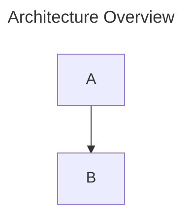

# Local Mermaid Management

A local-only Mermaid diagram manager for pasting, rendering, organizing, and exporting Mermaid.js diagrams.

This app is built for personal use on your own machine. It is not designed for hosting, multi-user access, accounts, cloud sync, or production deployment.

## Features

- Paste Mermaid code from an LLM or another source.
- Render Mermaid diagrams live in the browser.
- Save diagrams as local `.mmd` files.
- Browse, group, move, and delete saved diagrams from the sidebar.
- Create collapsible sidebar sections and drag diagrams into them.
- Reorder sidebar sections with drag and drop. New sections appear first by default.
- Rename diagrams and sections with double-click.
- Keep delete controls hidden until sidebar edit mode is enabled.
- Add markdown brief notes for business rules, assumptions, limitations, pain points, decisions, open questions, element notes, boundary/edge cases, constraints, data/integration, and compliance/policy considerations.
- Use free-form `#` headings in brief notes; helper categories are only writing prompts, not a required schema.
- Toggle brief notes into the preview and export exactly what is visible.
- Copy Mermaid source code to the clipboard.
- Export rendered diagrams as SVG, PNG, or WebP.
- Use Mermaid frontmatter `title` as the default name for unsaved diagrams.
- Resize the editor/preview split.
- Pan and zoom the diagram preview.

## Local Storage Model

Saved diagrams are stored as files in:

```text
diagrams/
```

Each saved diagram is written as one `.mmd` file. The app only saves a diagram when you explicitly press Save.

Sidebar sections are stored as local metadata in:

```text
diagrams/.sections.json
```

Diagram files stay flat in `diagrams/`; moving a diagram into a section only updates metadata. Deleting a section moves its diagrams back to the default Uncategorized area.

Diagram notes are stored as sidecar files next to the diagram:

```text
diagrams/<diagram-name>.notes.json
```

Brief notes are stored as markdown. Category helpers insert top-level headings such as `# Business Rule`, `# Constraint`, and `# Compliance / Policy`; the category selector includes hover text explaining each category. You can also write your own top-level headings such as `# Forretningsregler` or `# Mål`, and each heading becomes its own brief section. Notes are saved explicitly with the diagram.

## Sidebar Organization

- Double-click a diagram name in the sidebar, or the selected diagram title in the main toolbar, to rename it.
- Double-click a section name to rename the section.
- Use the sidebar edit toggle to show or hide delete buttons.
- Success messages such as saved, renamed, created, and deleted clear automatically after three seconds.

## Brief Notes And Export

- The left writing area has tabs for Mermaid code and markdown brief notes.
- The Brief view toggle controls whether notes are shown in the rendered preview.
- Brief notes can be placed below or to the right of the diagram before export.
- Brief notes can be rendered vertically or as a horizontal category/content grid.
- SVG brief rendering supports plain text, bullets, numbered lists, quotes, and subheadings.
- SVG, PNG, and WebP export buttons export the current preview state: diagram only when Brief view is off, or diagram plus brief when Brief view is on.
- SVG exports with brief notes keep note text as real SVG text elements, so tools that parse SVG text can read it without OCR.

By default, this repository ignores saved diagram files:

```gitignore
diagrams/*
!diagrams/.gitkeep
```

That keeps the `diagrams/` folder present without committing your personal diagrams.

If you want to store your diagrams and section metadata in Git, remove those two `diagrams/` lines from `.gitignore`, then add and commit the `.mmd` files, `.sections.json` metadata, and matching `.notes.json` files you want to version.

## Getting Started

Install dependencies:

```bash
npm install
```

Start the local app:

```bash
npm run dev
```

Open:

```text
http://127.0.0.1:5173/
```

The local API runs on:

```text
http://127.0.0.1:3001/
```

## Mermaid Frontmatter Titles

For unsaved diagrams, the app uses Mermaid frontmatter `title` as the default save name and export filename:



This exports as `Architecture-Overview.svg`, `Architecture-Overview.png`, or `Architecture-Overview.webp` until the diagram is saved under another name.

## Scripts

Run tests:

```bash
npm test
```

Build the app:

```bash
npm run build
```

Run the local development server:

```bash
npm run dev
```

## Notes

- The app uses the latest Mermaid package available when dependencies are installed.
- SVG export serializes the rendered Mermaid SVG before download so exported files are valid SVG/XML.
- PNG and WebP export rasterize the rendered SVG in the browser before download.
- Preview pan and zoom only affect the browser view. Exported files are not modified by the current zoom or pan state.
