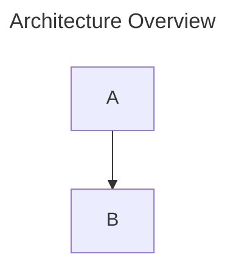

# Local Mermaid Management

A local-only Mermaid diagram manager for pasting, rendering, organizing, and exporting Mermaid.js diagrams.

This app is built for personal use on your own machine. It is not designed for hosting, multi-user access, accounts, cloud sync, or production deployment.

## Features

- Paste Mermaid code from an LLM or another source.
- Render Mermaid diagrams live in the browser.
- Save diagrams as local `.mmd` files.
- Browse, group, move, and delete saved diagrams from the sidebar.
- Create collapsible sidebar sections and drag diagrams into them.
- Reorder sidebar sections with drag and drop. New sections appear first by default.
- Copy Mermaid source code to the clipboard.
- Export rendered diagrams as SVG, PNG, or WebP.
- Use Mermaid frontmatter `title` as the default name for unsaved diagrams.
- Resize the editor/preview split.
- Pan and zoom the diagram preview.

## Local Storage Model

Saved diagrams are stored as files in:

```text
diagrams/
```

Each saved diagram is written as one `.mmd` file. The app only saves a diagram when you explicitly press Save.

Sidebar sections are stored as local metadata in:

```text
diagrams/.sections.json
```

Diagram files stay flat in `diagrams/`; moving a diagram into a section only updates metadata. Deleting a section moves its diagrams back to the default Uncategorized area.

By default, this repository ignores saved diagram files:

```gitignore
diagrams/*
!diagrams/.gitkeep
```

That keeps the `diagrams/` folder present without committing your personal diagrams.

If you want to store your diagrams and section metadata in Git, remove those two `diagrams/` lines from `.gitignore`, then add and commit the `.mmd` files and `.sections.json` metadata you want to version.

## Getting Started

Install dependencies:

```bash
npm install
```

Start the local app:

```bash
npm run dev
```

Open:

```text
http://127.0.0.1:5173/
```

The local API runs on:

```text
http://127.0.0.1:3001/
```

## Mermaid Frontmatter Titles

For unsaved diagrams, the app uses Mermaid frontmatter `title` as the default save name and export filename:



This exports as `Architecture-Overview.svg`, `Architecture-Overview.png`, or `Architecture-Overview.webp` until the diagram is saved under another name.

## Scripts

Run tests:

```bash
npm test
```

Build the app:

```bash
npm run build
```

Run the local development server:

```bash
npm run dev
```

## Notes

- The app uses the latest Mermaid package available when dependencies are installed.
- SVG export serializes the rendered Mermaid SVG before download so exported files are valid SVG/XML.
- PNG and WebP export rasterize the rendered SVG in the browser before download.
- Preview pan and zoom only affect the browser view. Exported files are not modified by the current zoom or pan state.
