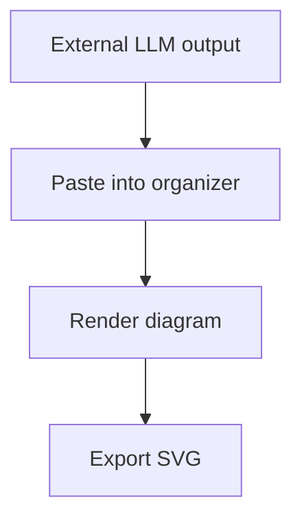

# Mermaid Organizer Implementation Plan

> **For agentic workers:** REQUIRED SUB-SKILL: Use superpowers:subagent-driven-development (recommended) or superpowers:executing-plans to implement this plan task-by-task. Steps use checkbox (`- [ ]`) syntax for tracking.

**Goal:** Build a local-only Mermaid.js code and diagram organizer that stores saved diagrams as repository `.mmd` files, renders pasted Mermaid code, and exports rendered diagrams as SVG.

**Architecture:** Use a Vite React TypeScript frontend for the split editor/preview UI and a small Express TypeScript server for repository file operations under `diagrams/`. The frontend talks to `/api/diagrams` through a typed API client, keeps edits in memory until Save is pressed, renders Mermaid client-side, and downloads SVG from the rendered preview.

**Tech Stack:** Vite, React, TypeScript, Express, Mermaid installed as `latest`, CodeMirror, Vitest, React Testing Library, Supertest, concurrently.

---

## File Structure

- Create `package.json`: scripts and dependencies.
- Create `tsconfig.json`, `tsconfig.node.json`, `vite.config.ts`, `vitest.config.ts`: TypeScript, Vite, and Vitest configuration.
- Create `index.html`: Vite entry point.
- Create `src/main.tsx`: React bootstrap.
- Create `src/App.tsx`: top-level app state, sidebar/editor/preview composition, unsaved-change handling.
- Create `src/App.css`: app layout and visual styling.
- Create `src/api/diagrams.ts`: typed frontend API client.
- Create `src/lib/mermaidInput.ts`: strip Markdown fences from pasted LLM output.
- Create `src/lib/download.ts`: browser SVG download helper.
- Create `src/components/Sidebar.tsx`: saved diagram list, new/delete actions.
- Create `src/components/CodeEditor.tsx`: CodeMirror editor and copy button.
- Create `src/components/PreviewPane.tsx`: Mermaid rendering and export button.
- Create `server/index.ts`: Express app and local dev server startup.
- Create `server/diagramStore.ts`: safe repository file operations for `diagrams/*.mmd`.
- Create `server/diagramStore.test.ts`: backend unit tests.
- Create `src/lib/mermaidInput.test.ts`: Markdown fence stripping tests.
- Create `src/App.test.tsx`: frontend behavior smoke tests.
- Create `diagrams/.gitkeep`: keep the diagram directory present before any saves.

## Task 1: Project Scaffold

**Files:**
- Create: `package.json`
- Create: `tsconfig.json`
- Create: `tsconfig.node.json`
- Create: `vite.config.ts`
- Create: `vitest.config.ts`
- Create: `index.html`
- Create: `src/main.tsx`
- Create: `src/App.tsx`
- Create: `src/App.css`
- Create: `diagrams/.gitkeep`

- [ ] **Step 1: Create package manifest**

Use this `package.json`:

```json
{
  "name": "mermaid-organizer",
  "private": true,
  "version": "0.1.0",
  "type": "module",
  "scripts": {
    "dev": "concurrently \"npm:dev:server\" \"npm:dev:client\"",
    "dev:client": "vite --host 127.0.0.1",
    "dev:server": "tsx watch server/index.ts",
    "build": "tsc -b && vite build",
    "preview": "vite preview --host 127.0.0.1",
    "test": "vitest run",
    "test:watch": "vitest"
  },
  "dependencies": {
    "@codemirror/commands": "latest",
    "@codemirror/lang-markdown": "latest",
    "@codemirror/state": "latest",
    "@codemirror/view": "latest",
    "@uiw/react-codemirror": "latest",
    "concurrently": "latest",
    "express": "latest",
    "lucide-react": "latest",
    "mermaid": "latest",
    "react": "latest",
    "react-dom": "latest"
  },
  "devDependencies": {
    "@testing-library/jest-dom": "latest",
    "@testing-library/react": "latest",
    "@testing-library/user-event": "latest",
    "@types/express": "latest",
    "@types/node": "latest",
    "@types/react": "latest",
    "@types/react-dom": "latest",
    "@types/supertest": "latest",
    "@vitejs/plugin-react": "latest",
    "jsdom": "latest",
    "supertest": "latest",
    "tsx": "latest",
    "typescript": "latest",
    "vite": "latest",
    "vitest": "latest"
  }
}
```

- [ ] **Step 2: Install dependencies**

Run:

```bash
npm install
```

Expected: dependencies install and `package-lock.json` is created. `mermaid` should resolve to the latest npm version available at install time because the dependency is declared as `latest`.

- [ ] **Step 3: Add TypeScript and Vite configuration**

Create `tsconfig.json`:

```json
{
  "files": [],
  "references": [
    { "path": "./tsconfig.node.json" }
  ],
  "compilerOptions": {
    "target": "ES2022",
    "useDefineForClassFields": true,
    "lib": ["ES2022", "DOM", "DOM.Iterable"],
    "allowJs": false,
    "skipLibCheck": true,
    "esModuleInterop": true,
    "allowSyntheticDefaultImports": true,
    "strict": true,
    "forceConsistentCasingInFileNames": true,
    "module": "ESNext",
    "moduleResolution": "Bundler",
    "resolveJsonModule": true,
    "isolatedModules": true,
    "noEmit": true,
    "jsx": "react-jsx"
  },
  "include": ["src", "server", "vite.config.ts", "vitest.config.ts"]
}
```

Create `tsconfig.node.json`:

```json
{
  "compilerOptions": {
    "composite": true,
    "module": "ESNext",
    "moduleResolution": "Bundler",
    "allowSyntheticDefaultImports": true,
    "strict": true,
    "skipLibCheck": true
  },
  "include": ["vite.config.ts", "vitest.config.ts"]
}
```

Create `vite.config.ts`:

```ts
import react from "@vitejs/plugin-react";
import { defineConfig } from "vite";

export default defineConfig({
  plugins: [react()],
  server: {
    proxy: {
      "/api": "http://127.0.0.1:5174"
    }
  }
});
```

Create `vitest.config.ts`:

```ts
import react from "@vitejs/plugin-react";
import { defineConfig } from "vitest/config";

export default defineConfig({
  plugins: [react()],
  test: {
    environment: "jsdom",
    globals: true,
    setupFiles: ["./src/test/setup.ts"]
  }
});
```

- [ ] **Step 4: Add minimal React entry files**

Create `index.html`:

```html
<!doctype html>
<html lang="en">
  <head>
    <meta charset="UTF-8" />
    <meta name="viewport" content="width=device-width, initial-scale=1.0" />
    <title>Mermaid Organizer</title>
  </head>
  <body>
    <div id="root"></div>
    <script type="module" src="/src/main.tsx"></script>
  </body>
</html>
```

Create `src/main.tsx`:

```tsx
import React from "react";
import ReactDOM from "react-dom/client";
import App from "./App";
import "./App.css";

ReactDOM.createRoot(document.getElementById("root")!).render(
  <React.StrictMode>
    <App />
  </React.StrictMode>
);
```

Create `src/App.tsx`:

```tsx
export default function App() {
  return (
    <main className="appShell">
      <aside className="sidebar">Diagrams</aside>
      <section className="workspace">
        <section className="pane">Code</section>
        <section className="pane">Preview</section>
      </section>
    </main>
  );
}
```

Create `src/App.css`:

```css
:root {
  color: #1d2733;
  background: #f4f6f8;
  font-family:
    Inter, ui-sans-serif, system-ui, -apple-system, BlinkMacSystemFont, "Segoe UI",
    sans-serif;
}

body {
  margin: 0;
}

button,
input,
textarea {
  font: inherit;
}

.appShell {
  display: grid;
  grid-template-columns: 280px minmax(0, 1fr);
  min-height: 100vh;
}

.sidebar {
  border-right: 1px solid #d8dee6;
  background: #ffffff;
  padding: 16px;
}

.workspace {
  display: grid;
  grid-template-columns: minmax(320px, 1fr) minmax(320px, 1fr);
  min-width: 0;
}

.pane {
  min-width: 0;
  padding: 16px;
}
```

Create `diagrams/.gitkeep` as an empty file.

- [ ] **Step 5: Verify scaffold**

Run:

```bash
npm run build
```

Expected: TypeScript and Vite complete successfully.

- [ ] **Step 6: Commit scaffold if git is initialized**

Run:

```bash
git status --short
git add package.json package-lock.json tsconfig.json tsconfig.node.json vite.config.ts vitest.config.ts index.html src/main.tsx src/App.tsx src/App.css diagrams/.gitkeep
git commit -m "chore: scaffold mermaid organizer"
```

Expected in the current workspace unless git is initialized first: `fatal: not a git repository`. Record that and continue without destructive git setup.

## Task 2: Backend Diagram Store

**Files:**
- Create: `server/diagramStore.ts`
- Create: `server/diagramStore.test.ts`

- [ ] **Step 1: Write failing backend tests**

Create `server/diagramStore.test.ts`:

```ts
import { mkdtemp, readFile, readdir } from "node:fs/promises";
import { tmpdir } from "node:os";
import path from "node:path";
import { describe, expect, it } from "vitest";
import {
  createDiagramStore,
  sanitizeDiagramName,
  toDiagramFilename
} from "./diagramStore";

describe("sanitizeDiagramName", () => {
  it("converts a human name into a safe base filename", () => {
    expect(sanitizeDiagramName("Customer Journey: Q2/2026")).toBe(
      "customer-journey-q2-2026"
    );
  });

  it("falls back to diagram for empty names", () => {
    expect(sanitizeDiagramName(" / ")).toBe("diagram");
  });
});

describe("toDiagramFilename", () => {
  it("always returns an mmd filename", () => {
    expect(toDiagramFilename("hello world")).toBe("hello-world.mmd");
    expect(toDiagramFilename("already.mmd")).toBe("already.mmd");
  });
});

describe("diagram store", () => {
  it("saves, lists, reads, and deletes mmd files", async () => {
    const root = await mkdtemp(path.join(tmpdir(), "mermaid-store-"));
    const store = createDiagramStore(root);

    const saved = await store.saveDiagram({
      name: "System Flow",
      code: "flowchart TD\n  A-->B"
    });

    expect(saved).toEqual({ name: "system-flow", filename: "system-flow.mmd" });
    expect(await store.listDiagrams()).toEqual([
      { name: "system-flow", filename: "system-flow.mmd" }
    ]);
    expect(await store.readDiagram("system-flow")).toEqual({
      name: "system-flow",
      filename: "system-flow.mmd",
      code: "flowchart TD\n  A-->B"
    });

    await store.deleteDiagram("system-flow");
    expect(await store.listDiagrams()).toEqual([]);
    expect(await readdir(root)).toEqual([]);
  });

  it("ignores non-mmd files when listing", async () => {
    const root = await mkdtemp(path.join(tmpdir(), "mermaid-store-"));
    const store = createDiagramStore(root);

    await store.saveDiagram({ name: "Kept", code: "graph TD;A-->B" });
    await readFile(path.join(root, "kept.mmd"), "utf8");

    expect(await store.listDiagrams()).toEqual([
      { name: "kept", filename: "kept.mmd" }
    ]);
  });
});
```

- [ ] **Step 2: Run tests to verify failure**

Run:

```bash
npm test -- server/diagramStore.test.ts
```

Expected: FAIL because `server/diagramStore.ts` does not exist.

- [ ] **Step 3: Implement diagram store**

Create `server/diagramStore.ts`:

```ts
import { mkdir, readFile, readdir, rm, writeFile } from "node:fs/promises";
import path from "node:path";

export type DiagramSummary = {
  name: string;
  filename: string;
};

export type DiagramRecord = DiagramSummary & {
  code: string;
};

export type SaveDiagramInput = {
  name: string;
  code: string;
};

export function sanitizeDiagramName(name: string): string {
  const sanitized = name
    .replace(/\.mmd$/i, "")
    .toLowerCase()
    .normalize("NFKD")
    .replace(/[\u0300-\u036f]/g, "")
    .replace(/[^a-z0-9]+/g, "-")
    .replace(/^-+|-+$/g, "")
    .slice(0, 80);

  return sanitized || "diagram";
}

export function toDiagramFilename(name: string): string {
  return `${sanitizeDiagramName(name)}.mmd`;
}

function assertSafeFilename(filename: string): void {
  if (filename !== path.basename(filename) || !filename.endsWith(".mmd")) {
    throw new Error("Invalid diagram filename");
  }
}

export function createDiagramStore(diagramsRoot: string) {
  async function ensureRoot() {
    await mkdir(diagramsRoot, { recursive: true });
  }

  function resolveDiagramPath(name: string) {
    const filename = toDiagramFilename(name);
    assertSafeFilename(filename);
    return { filename, filepath: path.join(diagramsRoot, filename) };
  }

  return {
    async listDiagrams(): Promise<DiagramSummary[]> {
      await ensureRoot();
      const entries = await readdir(diagramsRoot);

      return entries
        .filter((entry) => entry.endsWith(".mmd"))
        .sort((a, b) => a.localeCompare(b))
        .map((filename) => ({
          name: filename.replace(/\.mmd$/i, ""),
          filename
        }));
    },

    async readDiagram(name: string): Promise<DiagramRecord> {
      await ensureRoot();
      const { filename, filepath } = resolveDiagramPath(name);
      const code = await readFile(filepath, "utf8");

      return {
        name: filename.replace(/\.mmd$/i, ""),
        filename,
        code
      };
    },

    async saveDiagram(input: SaveDiagramInput): Promise<DiagramSummary> {
      await ensureRoot();
      const { filename, filepath } = resolveDiagramPath(input.name);
      await writeFile(filepath, input.code, "utf8");

      return {
        name: filename.replace(/\.mmd$/i, ""),
        filename
      };
    },

    async deleteDiagram(name: string): Promise<void> {
      await ensureRoot();
      const { filepath } = resolveDiagramPath(name);
      await rm(filepath, { force: true });
    }
  };
}
```

- [ ] **Step 4: Run backend store tests**

Run:

```bash
npm test -- server/diagramStore.test.ts
```

Expected: PASS.

## Task 3: Express API

**Files:**
- Create: `server/index.ts`
- Modify: `server/diagramStore.test.ts`

- [ ] **Step 1: Add API tests**

Append these tests to `server/diagramStore.test.ts`:

```ts
import request from "supertest";
import { createApp } from "./index";

describe("diagram API", () => {
  it("creates, lists, reads, and deletes diagrams through HTTP", async () => {
    const root = await mkdtemp(path.join(tmpdir(), "mermaid-api-"));
    const app = createApp(root);

    await request(app)
      .post("/api/diagrams")
      .send({ name: "API Flow", code: "flowchart LR\n  A-->B" })
      .expect(200)
      .expect(({ body }) => {
        expect(body).toEqual({ name: "api-flow", filename: "api-flow.mmd" });
      });

    await request(app)
      .get("/api/diagrams")
      .expect(200)
      .expect(({ body }) => {
        expect(body).toEqual([{ name: "api-flow", filename: "api-flow.mmd" }]);
      });

    await request(app)
      .get("/api/diagrams/api-flow")
      .expect(200)
      .expect(({ body }) => {
        expect(body.code).toBe("flowchart LR\n  A-->B");
      });

    await request(app).delete("/api/diagrams/api-flow").expect(204);
    await request(app).get("/api/diagrams").expect(200, []);
  });
});
```

- [ ] **Step 2: Run tests to verify failure**

Run:

```bash
npm test -- server/diagramStore.test.ts
```

Expected: FAIL because `server/index.ts` does not exist.

- [ ] **Step 3: Implement Express app**

Create `server/index.ts`:

```ts
import express from "express";
import path from "node:path";
import { fileURLToPath } from "node:url";
import { createDiagramStore } from "./diagramStore";

const __dirname = path.dirname(fileURLToPath(import.meta.url));
const repoRoot = path.resolve(__dirname, "..");
const defaultDiagramsRoot = path.join(repoRoot, "diagrams");

export function createApp(diagramsRoot = defaultDiagramsRoot) {
  const app = express();
  const store = createDiagramStore(diagramsRoot);

  app.use(express.json({ limit: "1mb" }));

  app.get("/api/diagrams", async (_req, res, next) => {
    try {
      res.json(await store.listDiagrams());
    } catch (error) {
      next(error);
    }
  });

  app.get("/api/diagrams/:name", async (req, res, next) => {
    try {
      res.json(await store.readDiagram(req.params.name));
    } catch (error) {
      next(error);
    }
  });

  app.post("/api/diagrams", async (req, res, next) => {
    try {
      const { name, code } = req.body as { name?: unknown; code?: unknown };

      if (typeof name !== "string" || typeof code !== "string") {
        res.status(400).json({ error: "Expected string name and code" });
        return;
      }

      res.json(await store.saveDiagram({ name, code }));
    } catch (error) {
      next(error);
    }
  });

  app.delete("/api/diagrams/:name", async (req, res, next) => {
    try {
      await store.deleteDiagram(req.params.name);
      res.status(204).end();
    } catch (error) {
      next(error);
    }
  });

  app.use(
    (
      error: unknown,
      _req: express.Request,
      res: express.Response,
      _next: express.NextFunction
    ) => {
      const message = error instanceof Error ? error.message : "Unknown error";
      res.status(500).json({ error: message });
    }
  );

  return app;
}

if (process.env.NODE_ENV !== "test") {
  createApp().listen(5174, "127.0.0.1", () => {
    console.log("Diagram API listening on http://127.0.0.1:5174");
  });
}
```

- [ ] **Step 4: Run API tests**

Run:

```bash
npm test -- server/diagramStore.test.ts
```

Expected: PASS.

## Task 4: Shared Frontend Utilities

**Files:**
- Create: `src/test/setup.ts`
- Create: `src/lib/mermaidInput.ts`
- Create: `src/lib/mermaidInput.test.ts`
- Create: `src/api/diagrams.ts`
- Create: `src/lib/download.ts`

- [ ] **Step 1: Add test setup**

Create `src/test/setup.ts`:

```ts
import "@testing-library/jest-dom/vitest";
```

- [ ] **Step 2: Write failing fence-stripping tests**

Create `src/lib/mermaidInput.test.ts`:

```ts
import { describe, expect, it } from "vitest";
import { stripMermaidFences } from "./mermaidInput";

describe("stripMermaidFences", () => {
  it("returns raw Mermaid code unchanged", () => {
    expect(stripMermaidFences("flowchart TD\n  A-->B")).toBe(
      "flowchart TD\n  A-->B"
    );
  });

  it("strips mermaid markdown fences", () => {
    expect(stripMermaidFences("```mermaid\nflowchart TD\n  A-->B\n```")).toBe(
      "flowchart TD\n  A-->B"
    );
  });

  it("strips generic markdown fences", () => {
    expect(stripMermaidFences("```\nsequenceDiagram\n  A->>B: Hi\n```")).toBe(
      "sequenceDiagram\n  A->>B: Hi"
    );
  });
});
```

- [ ] **Step 3: Run tests to verify failure**

Run:

```bash
npm test -- src/lib/mermaidInput.test.ts
```

Expected: FAIL because `src/lib/mermaidInput.ts` does not exist.

- [ ] **Step 4: Implement utilities**

Create `src/lib/mermaidInput.ts`:

```ts
export function stripMermaidFences(value: string): string {
  const trimmed = value.trim();
  const match = trimmed.match(/^```(?:mermaid)?\s*\n([\s\S]*?)\n```$/i);
  return match ? match[1].trim() : value;
}
```

Create `src/api/diagrams.ts`:

```ts
export type DiagramSummary = {
  name: string;
  filename: string;
};

export type DiagramRecord = DiagramSummary & {
  code: string;
};

async function requestJson<T>(url: string, options?: RequestInit): Promise<T> {
  const response = await fetch(url, options);

  if (!response.ok) {
    const body = await response.json().catch(() => ({ error: response.statusText }));
    throw new Error(body.error ?? response.statusText);
  }

  return response.json() as Promise<T>;
}

export async function listDiagrams(): Promise<DiagramSummary[]> {
  return requestJson<DiagramSummary[]>("/api/diagrams");
}

export async function loadDiagram(name: string): Promise<DiagramRecord> {
  return requestJson<DiagramRecord>(`/api/diagrams/${encodeURIComponent(name)}`);
}

export async function saveDiagram(input: {
  name: string;
  code: string;
}): Promise<DiagramSummary> {
  return requestJson<DiagramSummary>("/api/diagrams", {
    method: "POST",
    headers: { "Content-Type": "application/json" },
    body: JSON.stringify(input)
  });
}

export async function deleteDiagram(name: string): Promise<void> {
  const response = await fetch(`/api/diagrams/${encodeURIComponent(name)}`, {
    method: "DELETE"
  });

  if (!response.ok) {
    throw new Error(response.statusText);
  }
}
```

Create `src/lib/download.ts`:

```ts
export function downloadTextFile(filename: string, content: string, type: string) {
  const blob = new Blob([content], { type });
  const url = URL.createObjectURL(blob);
  const link = document.createElement("a");

  link.href = url;
  link.download = filename;
  document.body.append(link);
  link.click();
  link.remove();
  URL.revokeObjectURL(url);
}
```

- [ ] **Step 5: Run utility tests**

Run:

```bash
npm test -- src/lib/mermaidInput.test.ts
```

Expected: PASS.

## Task 5: React Components And App Behavior

**Files:**
- Create: `src/components/Sidebar.tsx`
- Create: `src/components/CodeEditor.tsx`
- Create: `src/components/PreviewPane.tsx`
- Modify: `src/App.tsx`
- Modify: `src/App.css`
- Create: `src/App.test.tsx`

- [ ] **Step 1: Write frontend smoke tests**

Create `src/App.test.tsx`:

```tsx
import { render, screen, waitFor } from "@testing-library/react";
import userEvent from "@testing-library/user-event";
import { beforeEach, describe, expect, it, vi } from "vitest";
import App from "./App";

beforeEach(() => {
  vi.restoreAllMocks();
  vi.stubGlobal("fetch", vi.fn(async (url: string, options?: RequestInit) => {
    if (url === "/api/diagrams" && !options) {
      return Response.json([{ name: "saved-flow", filename: "saved-flow.mmd" }]);
    }

    if (url === "/api/diagrams/saved-flow") {
      return Response.json({
        name: "saved-flow",
        filename: "saved-flow.mmd",
        code: "flowchart TD\n  A-->B"
      });
    }

    if (url === "/api/diagrams" && options?.method === "POST") {
      return Response.json({ name: "new-flow", filename: "new-flow.mmd" });
    }

    return new Response(null, { status: 204 });
  }));
});

describe("App", () => {
  it("lists saved diagrams and loads one into the editor", async () => {
    render(<App />);

    const item = await screen.findByRole("button", { name: /saved-flow/i });
    await userEvent.click(item);

    expect(await screen.findByDisplayValue(/flowchart TD/)).toBeInTheDocument();
  });

  it("strips markdown fences before inserting pasted code", async () => {
    render(<App />);

    const editor = screen.getByLabelText(/mermaid code/i);
    await userEvent.clear(editor);
    await userEvent.paste("```mermaid\nflowchart LR\n  A-->B\n```");

    expect(screen.getByDisplayValue("flowchart LR\n  A-->B")).toBeInTheDocument();
  });
});
```

- [ ] **Step 2: Run frontend tests to verify failure**

Run:

```bash
npm test -- src/App.test.tsx
```

Expected: FAIL because the app has no real controls yet.

- [ ] **Step 3: Implement sidebar**

Create `src/components/Sidebar.tsx`:

```tsx
import { Plus, Trash2 } from "lucide-react";
import type { DiagramSummary } from "../api/diagrams";

type SidebarProps = {
  diagrams: DiagramSummary[];
  selectedName: string | null;
  onNew: () => void;
  onSelect: (name: string) => void;
  onDelete: (name: string) => void;
};

export function Sidebar({
  diagrams,
  selectedName,
  onNew,
  onSelect,
  onDelete
}: SidebarProps) {
  return (
    <aside className="sidebar">
      <div className="sidebarHeader">
        <h1>Mermaid</h1>
        <button className="iconButton" type="button" onClick={onNew} title="New diagram">
          <Plus size={18} />
        </button>
      </div>
      <nav className="diagramList" aria-label="Saved diagrams">
        {diagrams.map((diagram) => (
          <div className="diagramRow" key={diagram.filename}>
            <button
              className={diagram.name === selectedName ? "diagramItem active" : "diagramItem"}
              type="button"
              onClick={() => onSelect(diagram.name)}
            >
              {diagram.name}
            </button>
            <button
              className="iconButton"
              type="button"
              title={`Delete ${diagram.name}`}
              onClick={() => onDelete(diagram.name)}
            >
              <Trash2 size={16} />
            </button>
          </div>
        ))}
      </nav>
    </aside>
  );
}
```

- [ ] **Step 4: Implement code editor**

Create `src/components/CodeEditor.tsx`:

```tsx
import CodeMirror from "@uiw/react-codemirror";
import { markdown } from "@codemirror/lang-markdown";
import { EditorView } from "@codemirror/view";
import { Clipboard } from "lucide-react";
import { stripMermaidFences } from "../lib/mermaidInput";

type CodeEditorProps = {
  value: string;
  onChange: (value: string) => void;
};

export function CodeEditor({ value, onChange }: CodeEditorProps) {
  async function copyCode() {
    await navigator.clipboard.writeText(value);
  }

  return (
    <section className="editorPane">
      <div className="paneToolbar">
        <h2>Code</h2>
        <button className="toolbarButton" type="button" onClick={copyCode}>
          <Clipboard size={16} />
          Copy
        </button>
      </div>
      <textarea
        aria-label="Mermaid code"
        className="fallbackTextarea"
        value={value}
        onPaste={(event) => {
          const pasted = event.clipboardData.getData("text");
          const stripped = stripMermaidFences(pasted);

          if (stripped !== pasted) {
            event.preventDefault();
            onChange(stripped);
          }
        }}
        onChange={(event) => onChange(event.target.value)}
      />
      <div className="codeMirrorShell" aria-hidden="true">
        <CodeMirror
          value={value}
          height="100%"
          basicSetup={{ lineNumbers: true, foldGutter: false }}
          extensions={[markdown(), EditorView.lineWrapping]}
          onChange={onChange}
        />
      </div>
    </section>
  );
}
```

- [ ] **Step 5: Implement preview pane**

Create `src/components/PreviewPane.tsx`:

```tsx
import mermaid from "mermaid";
import { Download } from "lucide-react";
import { useEffect, useMemo, useState } from "react";
import { downloadTextFile } from "../lib/download";

mermaid.initialize({
  startOnLoad: false,
  securityLevel: "strict",
  theme: "default"
});

type PreviewPaneProps = {
  code: string;
  diagramName: string;
};

export function PreviewPane({ code, diagramName }: PreviewPaneProps) {
  const [svg, setSvg] = useState("");
  const [error, setError] = useState("");
  const renderId = useMemo(() => `mermaid-${crypto.randomUUID()}`, []);

  useEffect(() => {
    let cancelled = false;

    async function renderDiagram() {
      if (!code.trim()) {
        setSvg("");
        setError("");
        return;
      }

      try {
        await mermaid.parse(code);
        const result = await mermaid.render(renderId, code);

        if (!cancelled) {
          setSvg(result.svg);
          setError("");
        }
      } catch (renderError) {
        if (!cancelled) {
          setSvg("");
          setError(renderError instanceof Error ? renderError.message : "Mermaid render failed");
        }
      }
    }

    renderDiagram();

    return () => {
      cancelled = true;
    };
  }, [code, renderId]);

  function exportSvg() {
    if (!svg) {
      return;
    }

    downloadTextFile(`${diagramName || "diagram"}.svg`, svg, "image/svg+xml");
  }

  return (
    <section className="previewPane">
      <div className="paneToolbar">
        <h2>Preview</h2>
        <button
          className="toolbarButton"
          type="button"
          onClick={exportSvg}
          disabled={!svg}
        >
          <Download size={16} />
          Export SVG
        </button>
      </div>
      <div className="previewSurface">
        {error ? <pre className="renderError">{error}</pre> : null}
        {!error && svg ? (
          <div className="diagramCanvas" dangerouslySetInnerHTML={{ __html: svg }} />
        ) : null}
        {!error && !svg ? <p className="emptyPreview">Paste Mermaid code to render.</p> : null}
      </div>
    </section>
  );
}
```

- [ ] **Step 6: Implement top-level app state**

Replace `src/App.tsx` with:

```tsx
import { Save } from "lucide-react";
import { useEffect, useMemo, useState } from "react";
import {
  deleteDiagram,
  listDiagrams,
  loadDiagram,
  saveDiagram,
  type DiagramSummary
} from "./api/diagrams";
import { CodeEditor } from "./components/CodeEditor";
import { PreviewPane } from "./components/PreviewPane";
import { Sidebar } from "./components/Sidebar";

const starterCode = `flowchart TD
  A[Paste Mermaid code] --> B[Render preview]
  B --> C[Save explicitly]`;

export default function App() {
  const [diagrams, setDiagrams] = useState<DiagramSummary[]>([]);
  const [selectedName, setSelectedName] = useState<string | null>(null);
  const [code, setCode] = useState(starterCode);
  const [lastSavedCode, setLastSavedCode] = useState("");
  const [status, setStatus] = useState("");

  const isDirty = code !== lastSavedCode;
  const diagramName = useMemo(() => selectedName ?? "unsaved-diagram", [selectedName]);

  async function refreshList() {
    setDiagrams(await listDiagrams());
  }

  useEffect(() => {
    refreshList().catch((error) => setStatus(error.message));
  }, []);

  function confirmDiscard() {
    return !isDirty || window.confirm("Discard unsaved changes?");
  }

  async function handleNew() {
    if (!confirmDiscard()) {
      return;
    }

    setSelectedName(null);
    setCode("");
    setLastSavedCode("");
    setStatus("New unsaved diagram");
  }

  async function handleSelect(name: string) {
    if (!confirmDiscard()) {
      return;
    }

    const diagram = await loadDiagram(name);
    setSelectedName(diagram.name);
    setCode(diagram.code);
    setLastSavedCode(diagram.code);
    setStatus(`Loaded ${diagram.filename}`);
  }

  async function handleSave() {
    const requestedName =
      selectedName ?? window.prompt("Diagram name", "new-diagram") ?? "";
    const trimmedName = requestedName.trim();

    if (!trimmedName) {
      setStatus("Save cancelled");
      return;
    }

    const saved = await saveDiagram({ name: trimmedName, code });
    setSelectedName(saved.name);
    setLastSavedCode(code);
    await refreshList();
    setStatus(`Saved ${saved.filename}`);
  }

  async function handleDelete(name: string) {
    if (!window.confirm(`Delete ${name}?`)) {
      return;
    }

    await deleteDiagram(name);
    await refreshList();

    if (selectedName === name) {
      setSelectedName(null);
      setCode("");
      setLastSavedCode("");
    }

    setStatus(`Deleted ${name}.mmd`);
  }

  return (
    <main className="appShell">
      <Sidebar
        diagrams={diagrams}
        selectedName={selectedName}
        onNew={handleNew}
        onSelect={(name) => {
          handleSelect(name).catch((error) => setStatus(error.message));
        }}
        onDelete={(name) => {
          handleDelete(name).catch((error) => setStatus(error.message));
        }}
      />
      <section className="workspace">
        <header className="mainToolbar">
          <div>
            <p className="eyebrow">Local Mermaid organizer</p>
            <h1>{selectedName ?? "Unsaved diagram"}</h1>
          </div>
          <div className="toolbarActions">
            {isDirty ? <span className="dirtyState">Unsaved changes</span> : null}
            <button className="primaryButton" type="button" onClick={handleSave}>
              <Save size={16} />
              Save
            </button>
          </div>
        </header>
        <div className="splitView">
          <CodeEditor value={code} onChange={setCode} />
          <PreviewPane code={code} diagramName={diagramName} />
        </div>
        {status ? <div className="statusBar">{status}</div> : null}
      </section>
    </main>
  );
}
```

- [ ] **Step 7: Replace styling**

Replace `src/App.css` with the full app layout:

```css
:root {
  color: #1d2733;
  background: #eef2f5;
  font-family:
    Inter, ui-sans-serif, system-ui, -apple-system, BlinkMacSystemFont, "Segoe UI",
    sans-serif;
}

body {
  margin: 0;
}

button,
input,
textarea {
  font: inherit;
}

button {
  cursor: pointer;
}

button:disabled {
  cursor: not-allowed;
  opacity: 0.55;
}

.appShell {
  display: grid;
  grid-template-columns: 280px minmax(0, 1fr);
  min-height: 100vh;
}

.sidebar {
  border-right: 1px solid #d8dee6;
  background: #ffffff;
  padding: 16px;
}

.sidebarHeader,
.paneToolbar,
.mainToolbar,
.toolbarActions,
.diagramRow {
  display: flex;
  align-items: center;
}

.sidebarHeader,
.paneToolbar,
.mainToolbar {
  justify-content: space-between;
  gap: 12px;
}

.sidebarHeader h1,
.mainToolbar h1,
.paneToolbar h2 {
  margin: 0;
}

.sidebarHeader h1 {
  font-size: 20px;
}

.diagramList {
  display: grid;
  gap: 6px;
  margin-top: 18px;
}

.diagramRow {
  gap: 4px;
}

.diagramItem {
  flex: 1;
  min-width: 0;
  border: 0;
  border-radius: 6px;
  background: transparent;
  color: #263445;
  padding: 8px 10px;
  text-align: left;
}

.diagramItem.active,
.diagramItem:hover {
  background: #e7edf3;
}

.iconButton {
  display: inline-grid;
  width: 34px;
  height: 34px;
  place-items: center;
  border: 1px solid #d8dee6;
  border-radius: 6px;
  background: #ffffff;
  color: #263445;
}

.workspace {
  display: grid;
  grid-template-rows: auto minmax(0, 1fr) auto;
  min-width: 0;
}

.mainToolbar {
  border-bottom: 1px solid #d8dee6;
  background: #ffffff;
  padding: 14px 18px;
}

.eyebrow {
  margin: 0 0 4px;
  color: #66758a;
  font-size: 12px;
  text-transform: uppercase;
}

.mainToolbar h1 {
  font-size: 22px;
}

.toolbarActions {
  gap: 10px;
}

.dirtyState {
  color: #8a5a00;
  font-size: 14px;
}

.primaryButton,
.toolbarButton {
  display: inline-flex;
  align-items: center;
  gap: 7px;
  border: 1px solid #b8c4d2;
  border-radius: 6px;
  background: #ffffff;
  color: #1d2733;
  padding: 8px 12px;
}

.primaryButton {
  border-color: #12685f;
  background: #12685f;
  color: #ffffff;
}

.splitView {
  display: grid;
  grid-template-columns: minmax(320px, 1fr) minmax(320px, 1fr);
  min-height: 0;
}

.editorPane,
.previewPane {
  display: grid;
  grid-template-rows: auto minmax(0, 1fr);
  min-width: 0;
  padding: 16px;
}

.editorPane {
  border-right: 1px solid #d8dee6;
}

.paneToolbar {
  margin-bottom: 10px;
}

.paneToolbar h2 {
  font-size: 16px;
}

.fallbackTextarea {
  position: absolute;
  width: 1px;
  height: 1px;
  opacity: 0;
}

.codeMirrorShell,
.previewSurface {
  min-height: 0;
  overflow: auto;
  border: 1px solid #d8dee6;
  border-radius: 8px;
  background: #ffffff;
}

.codeMirrorShell .cm-editor {
  height: 100%;
  min-height: calc(100vh - 150px);
}

.previewSurface {
  display: grid;
  place-items: center;
  padding: 18px;
}

.diagramCanvas {
  max-width: 100%;
  overflow: auto;
}

.diagramCanvas svg {
  max-width: 100%;
  height: auto;
}

.renderError {
  justify-self: stretch;
  align-self: start;
  overflow: auto;
  color: #9c1c1c;
  white-space: pre-wrap;
}

.emptyPreview {
  color: #66758a;
}

.statusBar {
  border-top: 1px solid #d8dee6;
  background: #ffffff;
  color: #46566a;
  padding: 8px 18px;
  font-size: 14px;
}

@media (max-width: 900px) {
  .appShell {
    grid-template-columns: 1fr;
  }

  .sidebar {
    border-right: 0;
    border-bottom: 1px solid #d8dee6;
  }

  .splitView {
    grid-template-columns: 1fr;
  }

  .editorPane {
    border-right: 0;
    border-bottom: 1px solid #d8dee6;
  }
}
```

- [ ] **Step 8: Run frontend tests**

Run:

```bash
npm test -- src/App.test.tsx
```

Expected: PASS after any necessary small test-environment shims for `navigator.clipboard`, `crypto.randomUUID`, or Mermaid DOM behavior.

## Task 6: Polish Rendering, Clipboard, And Export Verification

**Files:**
- Modify: `src/components/CodeEditor.tsx`
- Modify: `src/components/PreviewPane.tsx`
- Modify: `src/App.test.tsx`

- [ ] **Step 1: Verify copy button manually**

Run the app:

```bash
npm run dev
```

Open the Vite URL, paste Mermaid code, click Copy, and paste into a text field. Expected: pasted text matches the editor contents without Markdown fences if they were stripped on paste.

- [ ] **Step 2: Verify SVG export manually**

With the app still running, paste:



Click Export SVG. Expected: browser downloads `unsaved-diagram.svg` or `<saved-name>.svg`, and the file contains an `<svg` element.

- [ ] **Step 3: Verify save/delete file behavior manually**

In the app, save the diagram as `llm-flow`, then run:

```bash
ls diagrams
sed -n '1,40p' diagrams/llm-flow.mmd
```

Expected: `llm-flow.mmd` exists and contains the pasted Mermaid code.

Delete it from the sidebar, then run:

```bash
ls diagrams
```

Expected: `llm-flow.mmd` is gone.

## Task 7: Final Verification

**Files:**
- No new files.

- [ ] **Step 1: Run all tests**

Run:

```bash
npm test
```

Expected: PASS.

- [ ] **Step 2: Run production build**

Run:

```bash
npm run build
```

Expected: PASS and `dist/` is created.

- [ ] **Step 3: Start the local dev server for user testing**

Run:

```bash
npm run dev
```

Expected: Express listens on `http://127.0.0.1:5174` and Vite prints a local frontend URL, normally `http://127.0.0.1:5173/`.

- [ ] **Step 4: Commit final implementation if git is initialized**

Run:

```bash
git status --short
git add .
git commit -m "feat: build local mermaid organizer"
```

Expected in the current workspace unless git is initialized first: `fatal: not a git repository`. Record that and do not initialize git unless the user asks.

## Self-Review

Spec coverage:

- Local-only personal tool: covered in architecture, package scripts, and out-of-scope decisions.
- Paste LLM Mermaid output: covered by `stripMermaidFences`, editor paste handling, and workflow tests.
- Sidebar organize/load/delete: covered by `Sidebar`, app state, and Express API tasks.
- Split code/rendered view: covered by `App.tsx`, `CodeEditor`, `PreviewPane`, and CSS.
- Explicit save only: covered by app dirty state and Save workflow.
- Repository file storage: covered by `diagramStore.ts` and API tests.
- Latest Mermaid.js: covered by `package.json` dependency `"mermaid": "latest"`.
- SVG export: covered by `PreviewPane` and manual verification.
- Copy code button: covered by `CodeEditor` and manual verification.
- Syntax highlighting: covered by CodeMirror with Markdown highlighting fallback.

Completeness scan: no deferred-work markers or unspecified implementation gaps remain.

Type consistency: frontend `DiagramSummary` and backend API response shapes both use `name` and `filename`; saved records add `code`.
